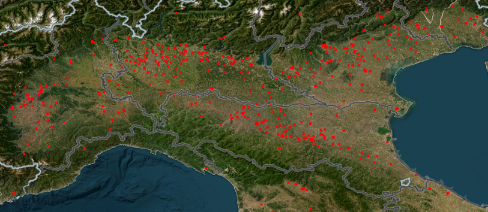
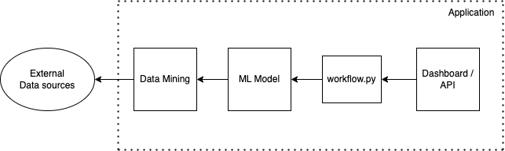
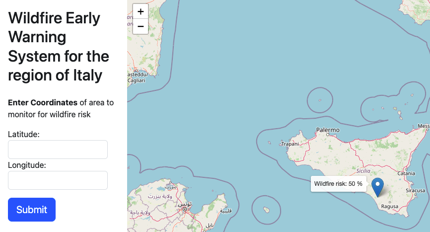

# An AI-Supported Wildfire Early Warning System for the Region of Italy



Using free and open remote sensing data in combination with publicly available records of wildfires in Europe, we built an AI early warning system to predict the risk of fire based on satelite imagery and weather data. This project aims to support local emergency response teams and actors by forecasting potential crisis zones.

The model's accuracy for this prototype is currently limited by training time and low-quality imagery, which can be improved with higher resolution aerial data and more frequent image captures.

## Technical Overview

The application currently consists of the following components:

- **React Frontend:** A dashboard and map, allowing the user to submit coordinates for prediction and to visualise results
- **Flask API:** Provides endpoints for interaction with the ML Model
- **Recurrent Neural Network:** A TensorFlow model built and trained on datasets from our sources listed below
- **Data Mining and Training:** scripts for data mining, processing, and model training

<p align="center">
  
</p>

This prototype was trained with a focus on the region of Italy, the frontend currently performs this validation by checking input-coordinates against a geojson [polygon of Italian borders](https://github.com/georgique/world-geojson). Only coordinates within its boundaries are sent via the API to the ML model, which in turn returns a wildfire prediction score for the location. This is displayed via a marker on the map.

One caveat to using open source data, as opposed to self-sourced aerial or drone imagery, is that the satellites used to collect the data are not geostationary. As a result, there may be insufficient data to make a prediction for a given set of coordinates. To ensure the accuracy and reliability of the model, we have implemented an error message to inform users when this situation occurs.

## Data Sources


All data we use for training and prediction is free and publicly available via the following sources:

### **1. [Sentinel Hub Process API](https://docs.sentinel-hub.com/api/latest/api/process)**

This database provides us with full spectrum satellite imagery (Sentinel 2) from the European Space Agency's Copernicus program.

To connect to the API from within the application, a `client_id` and `client_secret` are required. To get your credentials, create an account at https://www.sentinel-hub.com/

### **2\. [Open Meteo Historical Weather API](https://open-meteo.com/en/docs/historical-weather-api)**

Open source weather API offering hourly historical data with a high number of weather variables. No key required.

Weather features we used for training:

|                            |                            |
| -------------------------- | -------------------------- |
| - temperature 2m           | - soil temperature 7 to 28cm   |
| - relative humidity 2m     | - soil temperature 28 to 100cm |
| - apparent temperature     | - soil temperature 100 to 255cm |
| - precipitation            | - soil moisture 0 to 7cm      |
| - rain                     | - soil moisture 7 to 28cm     |
| - wind speed 10m           | - soil moisture 28 to 100cm   |
| - soil temperature 0 to 7cm| - soil moisture 100 to 255cm  |

## Labeled Data

The next two sources provide us with historical occurrences of wildfires, which have been used to create a combined dataset of training labels.

### **1\. [FIRMS Active Fire Data](https://firms.modaps.eosdis.nasa.gov/api/country/)**

Historical active fire data from NASA's Moderate Resolution Imaging Spectroradiometer (MODIS) and the Visible Infrared Imaging Radiometer Suite (VIIRS) onboard various satellites. Only dates and coordinates with a fire confidence of 'high' have been used.

request an API key at https://firms.modaps.eosdis.nasa.gov/api/map_key/

### **2\. [Firenews API](https://api2.effis.emergency.copernicus.eu/firenews/rest/firenews/firenews)**

Historical geolocated database of European fires reported on the internet. API endpoint provided upon request by the EFFIS - European Forest Fire Information System.

**Query Parameters (\* optional):**

```
notify: 1 (FIXED)
(*)place__icontains: <country/region/city/...>
startdate__gte: 2024-05-13T00:00:00.000Z
enddate__lte: 2024-05-28T23:59:59.999Z
(*)simpleplace__icontains: IT   (2 letters ISO country code)
ordering: -enddate,-startdate
limit: 20       (page size)
offset: 0       (page start from)
```

**Example URL**
https://api2.effis.emergency.copernicus.eu/firenews/rest/firenews/firenews?notify=1&place__icontains=fontana&startdate__gte=2024-05-13T00:00:00.000Z&enddate__lte=2024-05-28T23:59:59.999Z&simpleplace__icontains=IT&ordering=-enddate,-startdate&limit=20&offset=0

## Running the App

**1\. Clone the repository**

```
git clone https://github.com/R-bellH/ki_Geo_project.git
```

**2\. Enter Sentinel Hub API Keys in config**

Replace client_id and client_secret in `config` in root with your API keys. Credentials can be obtained by creating a [free Sentinel Hub account](https://www.sentinel-hub.com/).

**3\. Install Python and Node dependencies:**

```
pip install -r requirements.txt
```

from the frontend-dashboard, run `npm install` followed by `npm run start` to start the development server on port 3000


**4\. Download the model**

Download the trained RNN Model via [Dropbox](https://www.dropbox.com/scl/fi/omrx9etvw01932h9yf5kl/wildfire_ews_model.h5?rlkey=o291s0e7wgljv1xi28yw4vfvk&st=5zrs44p7&dl=0) and add it to the project root

**5\. or make it yourself**

cd into the 'data_mining' directory and run the main.ipynb notebook to gather the data and train the model

## App Dashboard




---
## Model Performance Metrics:

- Accuracy Score: 0.76
- Recall Score: 0.59
- Precision Score: 0.65
- F1 Score: 0.62 

Confusion_matrix:

| 37 | 7  |
|----|----|
| 9  | 13 |

(for full details see the [model details](model_info.txt))

---

[Arbel Hadar](https://github.com/R-bellH)

[Jessica Lim](https://github.com/jesslyw)

[Opoku Kwabena](https://github.com/IamNanaKOB)

[Yuanzhe Dong](https://github.com/tapdefenser)

