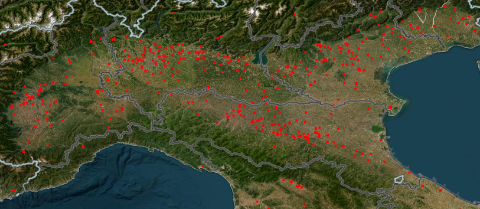

# **Sources**

we use the following data sources via their APIs

## **1. NASA's Fire Information for Resource Management System**

this database provides us with active fire data from the Moderate Resolution Imaging Spectroradiometer (MODIS) aboard the Aqua and Terra satellites, and the Visible Infrared Imaging Radiometer Suite (VIIRS) aboard S-NPP, NOAA 20 and NOAA 21 (formally known as JPSS-1 and JPSS-2).

**Documentation:**
https://firms.modaps.eosdis.nasa.gov/api/country/

**API Key**
request an API key at https://firms.modaps.eosdis.nasa.gov/api/map_key/

**Host:**
https://firms.modaps.eosdis.nasa.gov

**Endpoint:**
/api/country/html/&lt;mapkey&gt;/&lt;source&gt;/&lt;country&gt;/&lt;dayrange&gt;/&lt;date&gt;

**Example endpoint:**
https://firms.modaps.eosdis.nasa.gov/api/country/html/da61586d1810fd9751c0c93033dee077/VIIRS_SNPP_NRT/ITA/10/2023-07-06

**Example CSV output:**

```
country_id,latitude,longitude,bright_ti4,scan,track,acq_date,acq_time,satellite,instrument,confidence,version,bright_ti5,frp,daynight
ITA,40.50196,17.21493,303.05,0.54,0.42,2024-05-07,107,N,VIIRS,n,2.0NRT,286.83,1.26,N
ITA,40.51971,17.20793,297.06,0.54,0.42,2024-05-07,107,N,VIIRS,n,2.0NRT,284.91,1.62,N
ITA,40.62622,18.00068,303.12,0.39,0.44,2024-05-07,107,N,VIIRS,n,2.0NRT,283.89,0.91,N
ITA,42.57043,12.67622,305.37,0.39,0.36,2024-05-07,107,N,VIIRS,n,2.0NRT,281.76,0.55,N
ITA,37.38418,15.05077,317.16,0.49,0.4,2024-05-07,109,N,VIIRS,n,2.0NRT,260.85,2.16,N
ITA,38.7919,15.21219,302.25,0.47,0.4,2024-05-07,109,N,VIIRS,n,2.0NRT,275.7,0.59,N
ITA,38.79254,15.21121,309.44,0.48,0.4,2024-05-07,109,N,VIIRS,n,2.0NRT,276.27,1.08,N
ITA,38.79545,15.21359,308.52,0.47,0.4,2024-05-07,109,N,VIIRS,n,2.0NRT,276.26,0.88,N
ITA,38.79608,15.21265,301.85,0.48,0.4,2024-05-07,109,N,VIIRS,n,2.0NRT,276.35,1.08,N
```
| country_id | latitude | longitude | bright_ti4 | scan | track | acq_date | acq_time | satellite | instrument | confidence | version | bright_ti5 | frp  | daynight |
|------------|----------|-----------|------------|------|-------|----------|----------|-----------|------------|------------|---------|------------|------|----------|
| ITA        | 40.50196 | 17.21493  | 303.05     | 0.54 | 0.42  | 2024-05-07 | 107      | N         | VIIRS      | n          | 2.0NRT  | 286.83     | 1.26 | N        |
| ITA        | 40.51971 | 17.20793  | 297.06     | 0.54 | 0.42  | 2024-05-07 | 107      | N         | VIIRS      | n          | 2.0NRT  | 284.91     | 1.62 | N        |
| ITA        | 40.62622 | 18.00068  | 303.12     | 0.39 | 0.44  | 2024-05-07 | 107      | N         | VIIRS      | n          | 2.0NRT  | 283.89     | 0.91 | N        |
| ITA        | 42.57043 | 12.67622  | 305.37     | 0.39 | 0.36  | 2024-05-07 | 107      | N         | VIIRS      | n          | 2.0NRT  | 281.76     | 0.55 | N        |
| ITA        | 37.38418 | 15.05077  | 317.16     | 0.49 | 0.4   | 2024-05-07 | 109      | N         | VIIRS      | n          | 2.0NRT  | 260.85     | 2.16 | N        |
| ITA        | 38.7919  | 15.21219  | 302.25     | 0.47 | 0.4   | 2024-05-07 | 109      | N         | VIIRS      | n          | 2.0NRT  | 275.7      | 0.59 | N        |
| ITA        | 38.79254 | 15.21121  | 309.44     | 0.48 | 0.4   | 2024-05-07 | 109      | N         | VIIRS      | n          | 2.0NRT  | 276.27     | 1.08 | N        |
| ITA        | 38.79545 | 15.21359  | 308.52     | 0.47 | 0.4   | 2024-05-07 | 109      | N         | VIIRS      | n          | 2.0NRT  | 276.26     | 0.88 | N        |
| ITA        | 38.79608 | 15.21265  | 301.85     | 0.48 | 0.4   | 2024-05-07 | 109      | N         | VIIRS      | n          | 2.0NRT  | 276.35     | 1.08 | N        |
## **2. Copernicus Data Space Ecosystem (previously Copernicus Open Access Hub)**
this database provides us with satellite data from the European Space Agency's (ESA) Copernicus program.

**Documentation:**
https://documentation.dataspace.copernicus.eu/Home.html

**API Key**
to use this API follow the steps in this [link](https://documentation.dataspace.copernicus.eu/APIs/SentinelHub/Overview/Authentication.html) to authenticate and get your API keys.
enter your API keys and ID in the second cell of the notebook.

client_id = 'your client ID'

client_secret = 'your client secret'

### **2.2 sentinel Hub API**
this database provides us with raw satellite imagery from the European Space Agency's (ESA) Copernicus program.

**API Key**
to use this API you need to create an account on sentinelHUB and get API keys.
follow the steps in this [link](https://www.sentinel-hub.com/faq/where-get-instance-id/) to get instance ID.
you need to enter your instance ID, Client ID, and Client Secret in the forth cell of the notebook.

config.instance_id = 'your instance ID'

config.sh_client_secret = 'your client secret'

config.sh_client_id =  'your client ID>

to get client ID and secret follow the steps in this [link](https://docs.sentinel-hub.com/api/latest/api/overview/authentication/)

### **Firenews API**
Endpoint: https://api2.effis.emergency.copernicus.eu/firenews/rest/firenews/firenews

Example URL
https://api2.effis.emergency.copernicus.eu/firenews/rest/firenews/firenews?notify=1&place__icontains=fontana&startdate__gte=2024-05-13T00:00:00.000Z&enddate__lte=2024-05-28T23:59:59.999Z&simpleplace__icontains=IT&ordering=-enddate,-startdate&limit=20&offset=0

### **Weather data**
https://open-meteo.com/en/docs/historical-weather-api

# Dependencies
- sentinelhub
- oauthlib
- requests_oauthlib

Install them with:

```bash
pip install requests sentinelhub PIL
```
# more
you can find more information in [the presentation](Presentation1.pptx)


